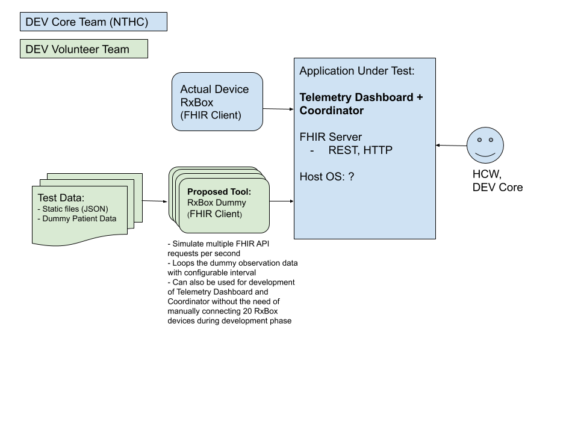

# RxBox Telemetry Unit Testing Tool

## Overview

This tool's purpose is to:
* Simulate multiple FHIR API requests per time interval
* Loops the dummy observation data with configurable interval
* Aims to be used for the development of Telemetry Dashboard and Coordinator without the need of manually configuring 20 or more RxBox devices during development phase



## Pre-Requesite
1. Tested on Ubuntu 18.04 LTS. Will probably work also on other OS that can run NodeJS.
1. Install NodeJS
    ```
    curl -sL https://deb.nodesource.com/setup_12.x | sudo -E bash -
    sudo apt install nodejs
    node --version
    npm --version
    ```

## How to Run

1. Run an FHIR Server.

    This can be the Telemetry Coordinator or the included dummy coordinator.

    To run the dummy coordinator:
    ```
    $ cd rxbox_simulator/src/dummy_coordinator
    $ npm start
    ```
1. Open a separate terminal
1. Run RxBox Telemetry Unit Testing Tool or dummy RxBox
    ```
    $ cd rxbox_simulator/src/client
    $ npm start
    ```

## How to Configure

1. Open `rxbox_simulator/src/client/config.json` for editing
1. To modify FHIR server settings:
    ```
    "server": {
        "ipAddress": "localhost", <--- Modify this with the target IP address
        "port": 3000 <--- Modify this with target Port (i.e. 80, 8080, etc.)
    }
    ```
1. To modify Vital Signs configurable settings:
    ```
    "vitalSigns": {
        "body-temperature": {
            "min": 30.0,  <--- Minimum value of randomly generate data 
            "max": 45.0,  <--- Maximum value of randomly generate data
            "significantDigits": 1, <--- Number of significant digits after decimal
            "fixedInterval": 1000  <--- Send FHIR HTTP Request per N milliseconds
        },
    ...
    ```

## NOTES

* FHIR JSON templates are taken from `www.hl7.org` and edited according to API specs:
    https://www.hl7.org/fhir/observation.html
